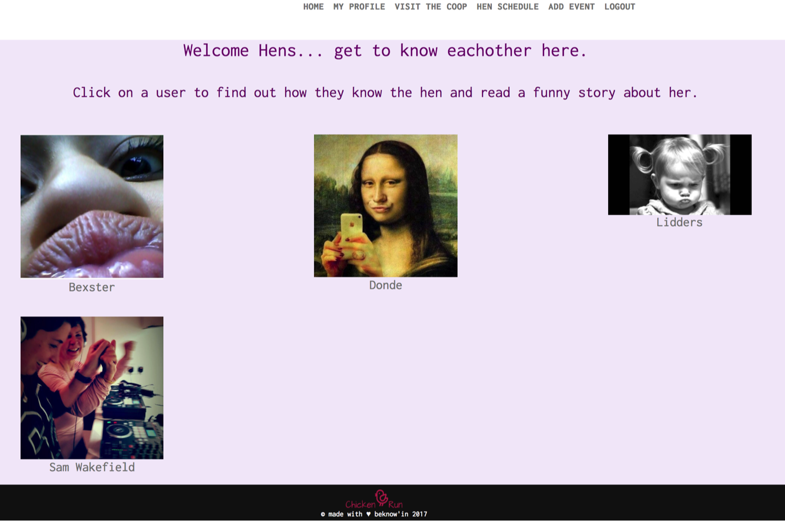
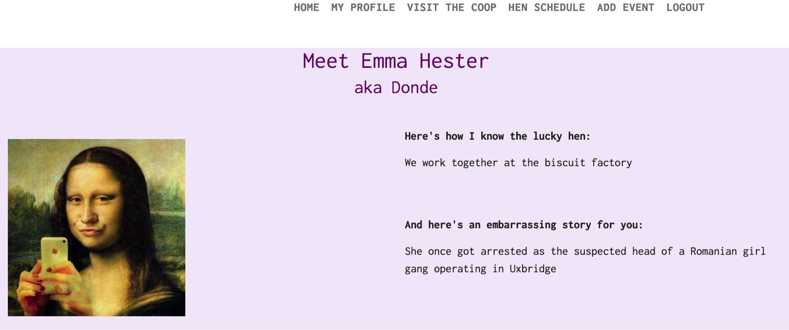
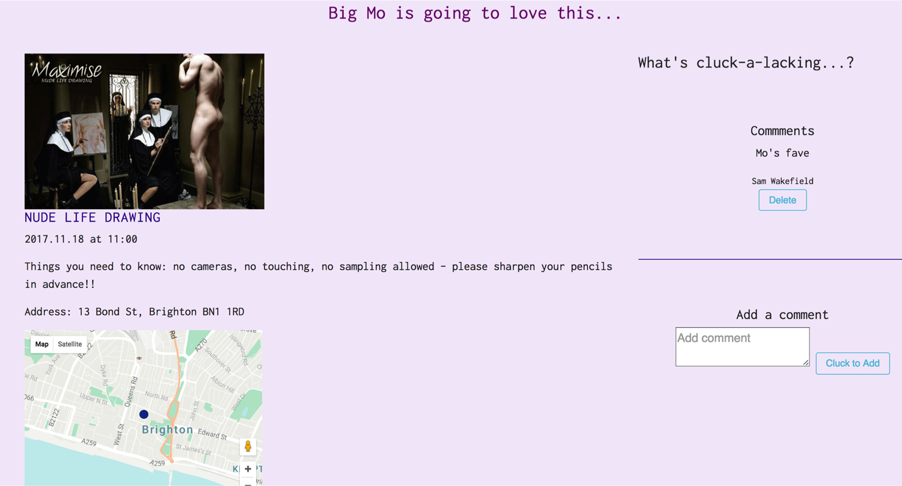

# Chicken Run - Hen-Do App

###GA WDI London - Project 2

#### An application for scheduling, sharing and socialising information about an organised hen weekend.

The site is designed to enable an organiser to share key logistical information with attendees to ensure the smooth running of what can sometimes be a chaotic event.

With often disparate groups of friends coming together, there is a focus on encouraging community with the sharing of stories so that attendees can get to know eachother before meeting.  Pictures, anecdotes and contact details are complemented by the ability to add comments. 

#####[UPDATE THIS WITH SALTY PLAINS URL!](https://safe-spire-58181.herokuapp.com/)

#####Home Screen
The welcome screen shows a sassy image of girls on a night out.  From this page, users must either login and authenticate by registering through the app directly or via Facebook.

Facebook users are re-directed to the profile page upon initial login, to complete their user profile.  This ensures consistency of the user journey and experience.
Subsequent logins via Facebook will not require this additional step.

####Profile pages
#####Visit the Coop
This index page shows all attendees for the weekend, by profile picture and nickname (username).

Clicking on a username will re-direct to the individual profile page.  Here, you will find further user information which includes:

* full name
* username
* profile picture
* the relationship between hen and attendee
* a funny story about the hen

Users are able to edit or delete their own profile only and can do so by accessing their details at 'My Profile'

####Hen Schedule
The full itinerary can be found in one place on the events index page.

Here a teaser image is visible along with the activity title, date and time.

Users can click on a specific event for more details.
An additional field is available which highlights further information and details about logistics, what to bring, reminders etc.

The address is provided which also links to a google map.

To the right of the page is a field which users can add comments to as well as delete them.

#####Add Event
Add event to upload a new event, which will show on the index page.

####Approach / How It Works
This is a full stack application which utilises RESTful routing.  

Secure routes ensure that only registered users can access the site. Profiles, comments and events can be deleted or edited only by their creator.

#####APIs used

1. Google Maps - autocomplete
2. Google Maps - XXX
3. Facebook Login
4. AWS S3 

####The Build

The following tools are used to build the site.

* JQuery
* Bootstrap SCSS
* Javascript 
* MongoDB
* The Google Web Fonts 'xxx', 'xxx' and 'xxx' have been used to style the site.

#### Problems & Challenges

The greatest challenges were:

1. planning and building the RESTful routes to ensure the correct routes were called depending on the actions required.
2. In addition, care needed to be taken to ensure the appropriate routes only were made secure.
3. Managing the multiple files and folders (each with minimal information for purposes of de-coupling) added a level of complexity when troubleshooting.
4. Planning the look and feel of the layout upfront and then sticking to the theme was challnging, as often the style emerged based on styling ability and know-how.
5. Bootstrap - a great tool but also requires some knowledge to make best use of it.
6. Styling!

####Wins
1. This project was made easier by the variety and quality of reference material from both coursework and lesson notes.  This enabled me to find solutions quickly, understand what my bugs were and quite often, how to fix them.  
2. The collaboration between all members of the team has been phenomenal.  Everyone has been able to give something back to the group to help someone else progress.  The teamwork element of coding is evident throughout this project and feels like second nature.

 

